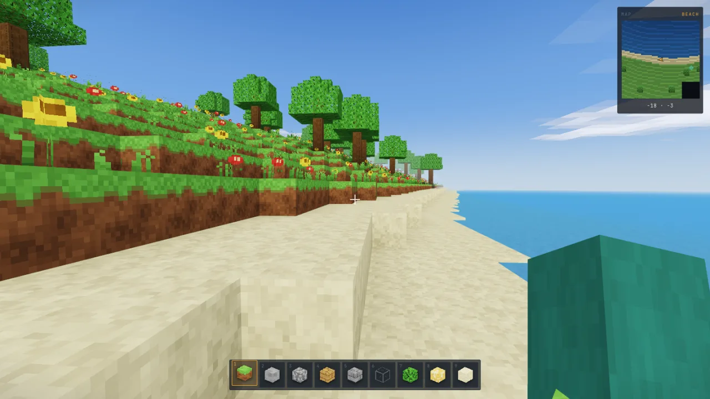
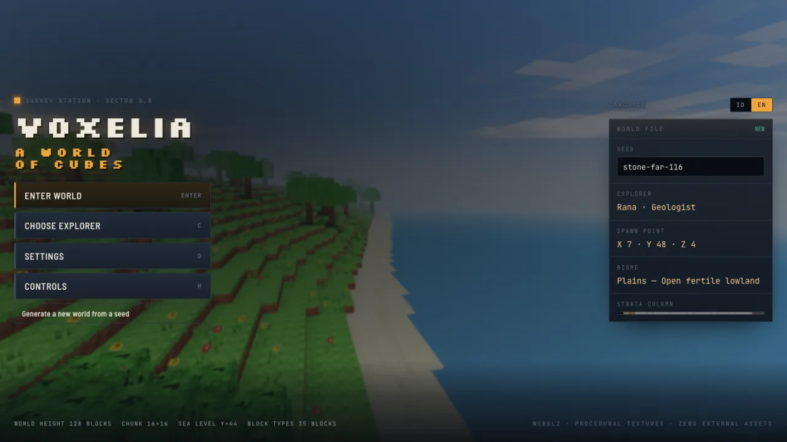
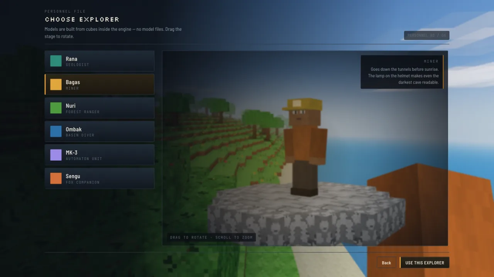
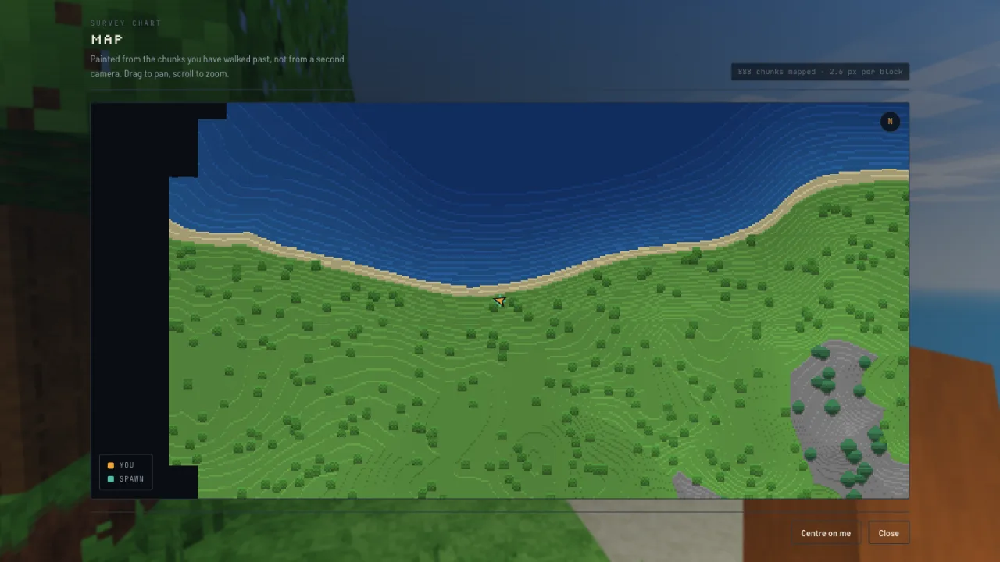

# Voxelia

A voxel sandbox that runs in the browser. One HTML file, **zero external assets** —
every texture, model and sound is generated by code when the page loads.

**Play:** <https://voxelia.skolain.id>



Requires WebGL2. No backend and no mandatory build step. The game itself loads no
image or audio file at all — the only pictures in this repository are the
screenshots on this page.

## Tech stack

| | |
|---|---|
| Language | Vanilla JavaScript (ES2020). No framework, no bundler, no TypeScript |
| Rendering | WebGL2 through [Three.js](https://threejs.org) r160 — the only runtime dependency |
| Shaders | Hand-written GLSL ES 3.00: terrain, fluids, sky, clouds, item previews |
| Textures | `DataArrayTexture`, 41 procedurally drawn 16×16 layers |
| Geometry | Custom mesher, 10 bytes per vertex, no built-in Three.js attributes |
| Audio | Web Audio API — oscillators and a generated noise buffer |
| Storage | `localStorage` for settings and world edits |
| i18n | Hand-rolled dictionary, 520 strings, English + Indonesian, switchable at runtime |
| Typography | Google Fonts: Silkscreen, Barlow Semi Condensed, JetBrains Mono |
| Build | A 29-line shell script that concatenates `src/` into one HTML file |
| Hosting | Cloudflare Pages |
| Size | ~5200 lines across 14 modules → a single 208 KB `index.html` |

## Features

- Endless procedural terrain: 12 biomes, caves, depth-layered ores, lakes, beaches, snowy peaks
- 35 block types you can dig and place, with edits persisted in the browser
- Full day–night cycle: sun, moon, stars, dusk gradients and blocky clouds
- 6 explorer models you can pick and spin in the menu, visible in third person
- Rippling transparent water, swaying plants, emissive blocks, a headlamp
- A corner minimap and a full pan/zoom map of everywhere you have been
- Keyboard, mouse and touch controls — plus arrow-key looking for mouse-free play
- English and Indonesian, switched live without a reload

## Screens

**Main menu** — drawn over the live world rather than a static backdrop, so the
terrain behind it is the world you are about to walk into.



**Explorers** — six of them, every one assembled from boxes in code with a
procedurally drawn skin. Drag the stage to turn the model.



**Map** — 888 chunks surveyed here. Ground you have not visited stays black, and
the relief shading comes from comparing each column against its northern
neighbour.



## Run locally

```bash
git clone https://github.com/rochmanramadhani/voxelia.git
cd voxelia
python3 -m http.server 8788
# open http://localhost:8788
```

The built `index.html` is committed, so you can also just open it directly. If
you edit anything under `src/`, rebuild with `./build.sh`.

## Technical notes

The five things in here most worth reading.

### Array textures instead of an atlas

A packed texture atlas has a chronic problem: once mipmaps are generated, texels
bleed between neighbouring tiles and distant blocks turn to mush. Voxelia uses a
WebGL2 `DataArrayTexture` instead — 41 textures of 16×16, one layer each. Every
layer gets its own mip chain, so there is no neighbour to bleed from. Blocks stay
crisp to the render distance with no padding and no UV inset.

See [`src/js/20-textures.js`](src/js/20-textures.js).

### 10 bytes per vertex

Positions are `Uint16` at 1/8 scale (6 bytes). Everything else is a single
`Uint8×4` attribute carrying ambient occlusion, skylight, texture layer index,
and packed flags — face direction, UV corner, and a sway bit. Ten bytes per
vertex, with no `position`, `normal` or `uv` attribute at all; normals and UVs
are reconstructed in the shader from the face index. The bounding sphere is set
by hand, because Three.js has nothing to compute one from.

See [`src/js/40-mesher.js`](src/js/40-mesher.js).

### Skylight that never seams between chunks

Voxel light is usually propagated with a breadth-first flood fill. The trouble is
that a per-chunk BFS only sees as far as its padding, so two adjacent chunks can
reach different conclusions about the same block — and the disagreement shows up
as a visible seam, most obviously inside caves.

Here skylight is instead a **pure function of column height**: `1 - (top - y) ×
0.11`, clamped at the bottom. Because it depends on neither generation order nor
chunk boundaries, two chunks cannot disagree. The trade-off is that enclosed
rooms go fully dark and need Glowstone — which is the behaviour you want anyway.
Leaves are a deliberate special case: they are non-opaque for face culling, so
leaf-against-leaf faces are skipped, but they still count as shade, so forest
floors sit in genuine shadow.

### A map with no second render pass

The obvious way to draw a minimap is a second orthographic camera pointed
straight down. That costs a full render pass every frame and can only ever show
chunks that are currently loaded.

Instead each chunk is painted once into a 16×16 tile — one pixel per column,
coloured by the average colour of the topmost block's texture, then shaded by
local slope and height above sea level. Cost to the GPU: nothing. And because the
tiles are cached independently of the chunks they came from, the map keeps
everything you have walked past long after those chunks are evicted, which turns
it into an exploration map for free. Tiles are invalidated when a chunk is
remeshed, so your own digging shows up.

See [`src/js/45-map.js`](src/js/45-map.js).

### Bugs worth recording

**The camera rolled.** Orientation was composed with `rotateY(yaw)` then
`rotateX(pitch)`, after which `rotation.z` was overwritten to add head bob.
Three.js Euler angles default to XYZ order, but an FPS orientation is YXZ — so
the correct `z` component is not zero. At yaw 1.0 rad and pitch 0.5 rad it is
−0.64 rad; it was being overwritten with −0.02. The camera therefore rolled by an
angle that changed every time the player looked around, and ten seconds of play
was enough to make you queasy. The fix is one line: `camera.rotation.order = 'YXZ'`.

**Loading hung in background tabs.** The loader yielded between steps with
`await requestAnimationFrame`. Browsers stop firing rAF in a tab that is not
visible, so opening Voxelia in a background tab left it stuck on step one
forever, with nothing in the console. There is now a 60 ms `setTimeout` fallback.

**The map came out stretched.** The map canvas sized its backing store when the
screen opened — before the browser had laid that screen out — so it was created
at 300×480 while being displayed at 740×310, and every tile came out smeared.
The draw call now re-measures against `clientWidth`/`clientHeight` and resizes
when they disagree, which fixes window resizing for free.

## Project layout

```
src/head.html       interface: DOM + CSS
src/js/00-util      seeded PRNG, Perlin noise, helpers
src/js/05-i18n      English + Indonesian dictionary, t() and runtime switching
src/js/10-blocks    35 block definitions and 41 texture layers
src/js/20-textures  procedural texture generator -> DataArrayTexture
src/js/30-world     chunks, terrain generation, biomes, trees, player edits
src/js/40-mesher    face culling, ambient occlusion, vertex packing
src/js/45-map       explored-terrain map painted from chunk data
src/js/50-materials terrain, fluid, sky and cloud shaders
src/js/55-models    character models, item geometry, icon baking
src/js/60-chunks    time-budgeted chunk loading
src/js/65-player    AABB collision, physics, DDA voxel raycast
src/js/70-ui        menus, settings, hotbar, inventory
src/js/80-audio     synthesised sound effects (Web Audio, no files)
src/js/90-main      assembly, day-night cycle, main loop
build.sh            concatenates everything into index.html
```

## Credits

The code here is original, but several of its formulas are canonical published
work rather than anything invented for this project:

- **Improved Perlin noise** — Ken Perlin (2002). The `6t⁵−15t⁴+10t³` fade curve and
  the `grad3` gradient table follow his reference implementation.
- **mulberry32** — public-domain PRNG, identified by the `0x6D2B79F5` constant.
- **MurmurHash3 finalizer** — Austin Appleby. The `0x85ebca6b` / `0xc2b2ae35`
  mixing constants in `hash2`.
- **A Fast Voxel Traversal Algorithm** — John Amanatides and Andrew Woo (1987).
  The DDA raycast used for block selection.
- **ACES filmic tone mapping approximation** — Krzysztof Narkowicz.
- **Hash without Sine** — Dave Hoskins (MIT). The `hash13` function in the sky shader.
- **Voxel ambient occlusion** — the per-vertex formula and the quad-flip trick that
  keeps the AO gradient from twisting, from Mikola Lysenko's *0 FPS* write-up.

All of the above are public domain, MIT, or pure algorithms, so none of it
conflicts with this project's licence.

The blocky look is a deliberate homage, but no Minecraft assets, code or data are
used anywhere in this project, and it is not affiliated with Mojang.

## Licence

[MIT](LICENSE).

## Making of

Written in a single session with Claude Opus 5 in Claude Code, starting from one
request: "build me a 3D website, your call, maybe something like Minecraft."

The part worth recording is not that a model wrote the code, but that both bugs
above were caught by **measurement rather than by looking at screenshots**. The
camera roll was tested by checking the Y component of the camera's right vector
across five yaw/pitch combinations — it has to be exactly zero — and by comparing
the camera's forward vector against the raycast direction, so the crosshair
provably points at the block that gets dug. The background-tab bug surfaced on its
own when the browser pane happened to be hidden during testing.
